<div align="center">

<picture></picture>

<br /><br />

<a href="https://www.linkedin.com/in/prayatna-pokhrel-288a72435/"></a>
<a href="mailto:p.codebyte@gmail.com"></a>
<a href="https://github.com/codebyte-p"></a>
<picture></picture>

<br /><br />

<picture></picture>

</div>

<picture></picture>

## `> operator_profile`

I am a **Cybersecurity and Ethical Hacking undergraduate** at Softwarica College of IT & E-Commerce, studying toward a BSc (Hons) awarded by Coventry University. I am building practical blue-team foundations for a future **Security Operations Centre (SOC)** role.

My current work centers on understanding security signals: how alerts are generated, how logs tell a story, and how analysts connect evidence across networks and systems to support an investigation.

```yaml
role_target: SOC Analyst
location: Kathmandu, Nepal
profile_theme: SELF_AWARE # visual profile theme
focus: [security monitoring, alert triage, log analysis, incident investigation]
learning_now: CompTIA Security+
mindset: observe -> correlate -> investigate -> improve
```

<picture></picture>

## `> analyst_loop`

<div align="center">
<picture></picture>
</div>

<picture></picture>

## `> capability_matrix`

| Domain | Current foundation |
|---|---|
| 🛡️ **Security Operations** | SIEM fundamentals · Alert investigation · Log analysis · Incident response concepts |
| 🧠 **Threat Context** | Cyber threat intelligence · Security scenario investigation |
| 🌐 **Networks** | Network enumeration with Nmap · DNS fundamentals |
| 🖥️ **Systems** | Linux · Windows |
| 🕸️ **Web Security** | Web-application attack fundamentals · Ffuf |
| 🎯 **Practice Platforms** | TryHackMe · Hack The Box Academy |

<div align="center">

<picture></picture>
<picture></picture>
<picture></picture>
<picture></picture>
<picture></picture>
<picture></picture>
<picture></picture>

</div>

<picture></picture>

## `> hands_on_training`

<table>
<tr>
<td width="50%" valign="top">

### `09` TryHackMe labs

Practical exercises covering:

- SIEM fundamentals
- Alert investigation
- Threat intelligence
- Incident-response concepts
- Linux, Windows, and DNS

</td>
<td width="50%" valign="top">

### `04` HTB Academy modules

Structured modules including:

- Network Enumeration with Nmap
- Attacking Web Applications with Ffuf
- Controlled security-lab investigation
- Repeatable technical note-taking

</td>
</tr>
</table>

<picture></picture>

## `> signal_event: deerhack_2025`

At **Deerhack School Edition 2025**, my team earned:

```diff
+ [WIN] Overall Winner
+ [WIN] Best Presentation
+ [WIN] Most Innovative Idea
```

I contributed to **front-end development and debugging**, helping the team deliver a working prototype and communicate the solution clearly to the judges.

<picture></picture>

## `> current_mission`

```text
[ ACTIVE  ] Preparing for CompTIA Security+
[ ACTIVE  ] Deepening SIEM, log-analysis, and alert-triage fundamentals
[ ONGOING ] Building a public body of hands-on cybersecurity work
[ SEEKING ] SOC internship or entry-level analyst opportunity
            with room to learn from an experienced team
```

<div align="center">

### `observe. correlate. investigate. improve.`

Open to learning, collaboration, and early-career cybersecurity opportunities.

<picture></picture>

</div>
